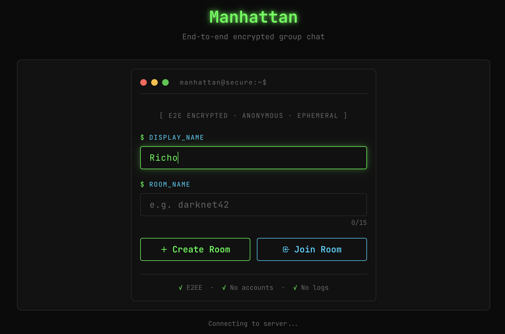
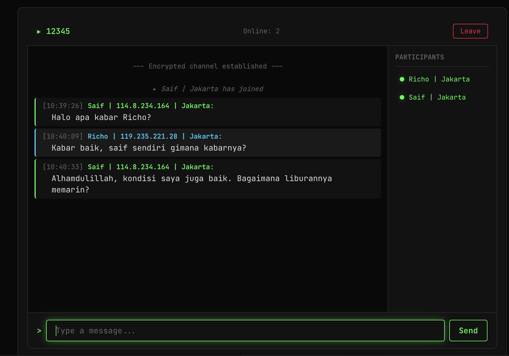

# Manhattan

Real-time group chat dengan end-to-end encryption. Server tidak pernah menyentuh plaintext pesan, ia hanya meneruskan ciphertext dari satu client ke client lain.

## Preview

[](https://ricoo.dev)
[](https://ricoo.dev)

**Live → [ricoo.dev](https://ricoo.dev)**

## Cara kerjanya

Setiap browser menghasilkan sepasang kunci RSA-2048 dan satu kunci AES-256-GCM saat pertama kali dibuka. Kunci privat RSA dan kunci AES tidak pernah meninggalkan browser.

Saat dua orang berada di room yang sama, mereka bertukar kunci AES melalui enkripsi RSA: kunci AES milik A dienkripsi dengan public key RSA milik B, lalu dikirim ke server untuk diteruskan. Server menerima blob terenkripsi dan meneruskannya tanpa membukanya. B mendekripsi blob itu dengan private key RSA-nya sendiri, dan sekarang B punya kunci AES milik A untuk mendekripsi pesan-pesan A.

Pesan dienkripsi dengan AES-256-GCM sebelum dikirim. Server menerima ciphertext, meneruskannya ke semua anggota room, dan tidak tahu isinya.

Identitas pengguna ditentukan oleh IP address. Satu IP, satu sesi.

## Tech stack

| Layer | Teknologi |
|---|---|
| Server | Java 23, Spring Boot 3.4, WebSocket/STOMP, Gradle |
| Client | Vanilla JS, Tailwind CSS, Web Crypto API, argon2-browser (WASM) |
| Database | MySQL 8.0 |
| Deploy | Ubuntu 22.04, Nginx, systemd |

## Struktur project

```
manhattan/
├── server/                  Spring Boot backend
│   ├── src/main/java/com/manhattan/
│   │   ├── config/          WebSocket dan retry config
│   │   ├── controller/      STOMP message handlers
│   │   ├── service/         Logika bisnis
│   │   ├── repository/      JPA repositories
│   │   ├── entity/          JPA entities (Room, Session, dll)
│   │   ├── dto/             Data transfer objects
│   │   └── interceptor/     IP guard saat WebSocket handshake
│   └── src/test/            Unit + property-based tests (jqwik)
├── client/
│   ├── src/
│   │   ├── crypto.js        Web Crypto API wrapper
│   │   ├── keystore.js      In-memory AES key store
│   │   ├── argon2.js        Argon2id WASM wrapper
│   │   ├── websocket-client.js  STOMP client
│   │   ├── key-exchange.js  RSA key exchange logic
│   │   ├── chat-controller.js   Chat state management
│   │   ├── room-controller.js   Room join/create flow
│   │   └── ui/              Komponen UI (room entry, chat, status bar)
│   └── tests/e2e/           Playwright end-to-end tests
├── deploy/                  Nginx config dan systemd service template
├── deploy.sh                Script deploy satu perintah untuk Ubuntu 22.04
└── .env.example             Template environment variables
```

## Prerequisites

- Java 23 (Eclipse Temurin direkomendasikan)
- Node.js 20 LTS
- MySQL 8.0
- Gradle 8+ (wrapper sudah ada di `server/`)

## Menjalankan secara lokal

### 1. Siapkan database

```bash
mysql -u root -p
```

```sql
CREATE DATABASE manhattan CHARACTER SET utf8mb4;
CREATE USER 'manhattan'@'localhost' IDENTIFIED BY 'manhattan';
GRANT ALL ON manhattan.* TO 'manhattan'@'localhost';
FLUSH PRIVILEGES;
```

Jalankan schema:

```bash
mysql -u manhattan -pmanhattan manhattan < server/src/main/resources/schema.sql
```

### 2. Jalankan server

```bash
cd server
./gradlew bootRun
```

Server berjalan di `http://localhost:8080`.

### 3. Jalankan client

```bash
cd client
npm install
npm run dev
```

Buka `http://localhost:3000` di browser.

> Untuk development lokal, buka dua tab browser berbeda. `IpGuardInterceptor` menambahkan suffix unik ke `127.0.0.1` sehingga dua tab bisa berjalan sebagai dua "user" berbeda.

## Konfigurasi

Konfigurasi server ada di `server/src/main/resources/application.yml`. Untuk production, gunakan environment variables:

```bash
cp .env.example .env
# Edit .env dengan kredensial database production
```

| Variable | Default | Keterangan |
|---|---|---|
| `DB_URL` | `jdbc:mysql://localhost:3306/manhattan` | JDBC URL database |
| `DB_USERNAME` | `manhattan` | Username database |
| `DB_PASSWORD` | `manhattan` | Password database |
| `SERVER_PORT` | `8080` | Port Spring Boot |

## Deploy ke production

Script `deploy.sh` menangani seluruh proses deploy ke Ubuntu 22.04 LTS dari nol:

```bash
chmod +x deploy.sh
sudo ./deploy.sh yourdomain.com
```

Yang dilakukan script:
1. Install Java 21, Node.js 20, MySQL, Nginx
2. Buat database dan jalankan schema
3. Build server JAR via Gradle
4. Build client (bundle JS + minify CSS)
5. Konfigurasi Nginx sebagai reverse proxy dengan SSL dari Let's Encrypt
6. Daftarkan dan jalankan systemd service

Setelah deploy selesai:

```bash
# Lihat log
journalctl -u manhattan -f

# Restart service
sudo systemctl restart manhattan

# Cek status
sudo systemctl status manhattan
```

## Menjalankan tests

**Server (JUnit 5 + jqwik property-based tests):**

```bash
cd server
./gradlew test
```

**Client (Jest + fast-check property-based tests):**

```bash
cd client
npm test
```

**End-to-end (Playwright):**

```bash
cd client
npm run test:e2e
```

## Alur enkripsi secara ringkas

```
Browser A                    Server                    Browser B
─────────────────────────────────────────────────────────────────
Generate RSA keypair
Generate AES key
                                                  Generate RSA keypair
                                                  Generate AES key

Connect + JOIN room ──────► Simpan session
                            Broadcast public key A ──► Terima public key A
                                                       Enkripsi AES_B dengan RSA_pub_A
                            ◄── Kirim encrypted AES_B
Dekripsi AES_B dengan RSA_priv_A
Simpan AES_B di Keystore

Enkripsi pesan dengan AES_A
Kirim ciphertext ────────► Teruskan ke semua ──────► Dekripsi dengan AES_A dari Keystore
```

## Batasan desain

- Satu IP address = satu sesi aktif. Dua tab dari IP yang sama akan ditolak di production.
- Maksimal 50 peserta per room.
- Password room di-hash dengan Argon2id (time cost 3, memory 64 MB, parallelism 4) di sisi client sebelum dikirim ke server.
- Setelah 5 kali salah password, IP dikunci selama 60 detik per room.
- Pesan untuk client yang sedang offline di-queue maksimal 500 pesan per client per room.
- Riwayat pesan tidak disimpan permanen. Saat client disconnect, pesan hilang dari sisi client.

## Lisensi

Private project.
